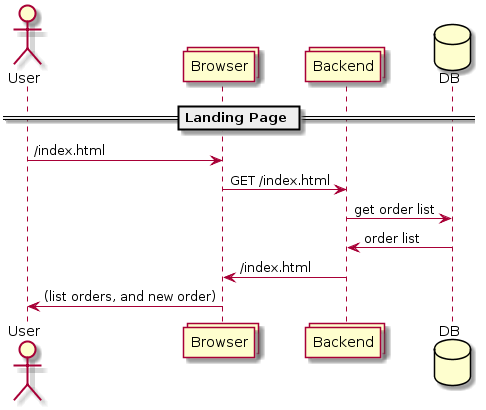
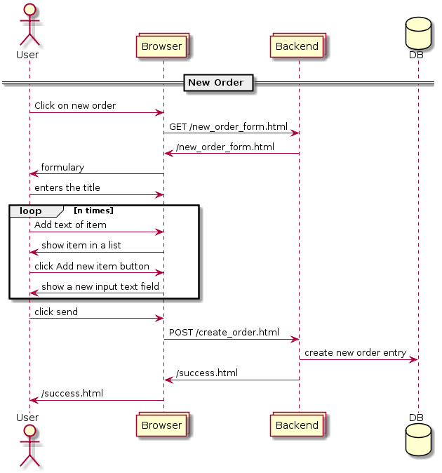
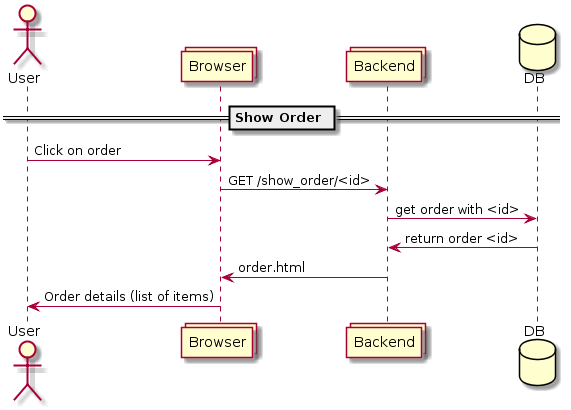
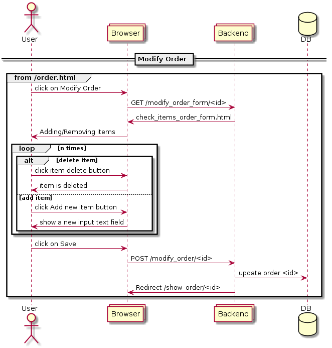
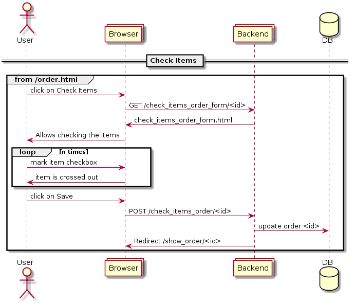
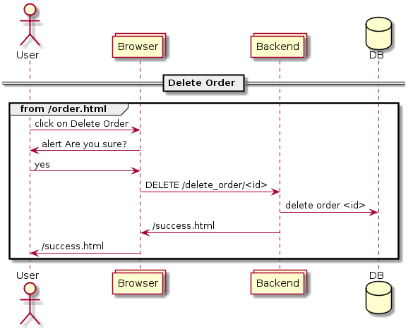

==========================
Práctica Arquitecturas Web
==========================

Simple Shop
===================

:Autor: Antonio Camas Maestre
:git: https://github.com/antoniocamas/shopping_cart_web_dev.git

.. contents:: Contenidos

.. raw:: pdf

   PageBreak

Frontend
========

Estilo. Platilla Bootstrap
""""""""""""""""""""""""""

La plantilla Bootstrap elegida es SB Admin 2.

https://startbootstrap.com/previews/sb-admin-2/

Código JavaScript
"""""""""""""""""

El código JavaScript que implemta los requisitos de la practic se puede encontrar en este fichero:

https://github.com/antoniocamas/shopping_cart_web_dev/blob/master/src/main/resources/static/js/behavior.js

Codigo Html
"""""""""""

Es generado en el backend con plantillas mustache. Localizado aqui:

https://github.com/antoniocamas/shopping_cart_web_dev/tree/master/src/main/resources/templates

Las partes communes a todas las páginas está divido en los ficheros: commonBottonTemplate.html y commonUpperTemplate.html

Backend
========

Desarrollado como aplicación Spring Boot con base de datos H2 para facilitar el despliegue en desarrollo.

Ficheros aquí:

https://github.com/antoniocamas/shopping_cart_web_dev/tree/master/src/main/java/antonio/camas/shop

Diagramas de Secuencia
======================

Página de inicio
""""""""""""""""

	  
   Página de inicio

Nuevo pedido
""""""""""""""""

	  
   Nuevo pedido

Detalles de Pedido
"""""""""""""""""""

	  
   Detalles de pedido

Modificar Pedido
""""""""""""""""

	  
   Modificar Pedido

Marcar elementos
""""""""""""""""   

	  
   Marcar Elementos

Borrar Pedido
""""""""""""""""

	  
   Borrar Pedido
   
